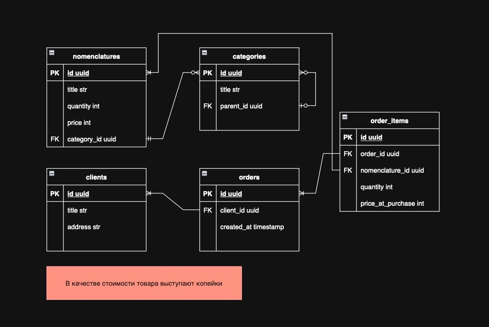

# Order Management Service

A RESTful API service for managing product orders, built with Python, FastAPI, and PostgreSQL. The project follows Clean Architecture principles and is fully containerized for easy setup and deployment.

## Architecture & Tech Stack

This project is built using a **Clean Architecture** approach, separating concerns into distinct layers:

- **Presentation**: Handles HTTP requests and responses (FastAPI).
- **Application**: Contains the core business logic and use cases (Interactors).
- **Infrastructure**: Manages external concerns like database access (SQLAlchemy) and dependency injection setup.
- **Models**: Defines the core domain entities.

**Tech Stack:**
- **Framework**: [FastAPI](https://fastapi.tiangolo.com/)
- **Database**: [PostgreSQL](https://www.postgresql.org/)
- **ORM**: [SQLAlchemy](https://www.sqlalchemy.org/)
- **Dependency Injection**: [Dishka](https://github.com/re-actors/dishka)
- **Package Management**: [uv](https://github.com/astral-sh/uv)
- **Containerization**: [Docker](https://www.docker.com/) & [Docker Compose](https://docs.docker.com/compose/)
- **Production Server**: [Gunicorn](https://gunicorn.org/)

## Database Schema

The database is designed to support a simple e-commerce workflow.



**Note**: To avoid floating-point inaccuracies, all monetary values (`price` and `price_at_purchase`) are stored as integers representing the price in **kopecks (cents)**.

## Getting Started

Follow these instructions to get the project up and running on your local machine.

### Prerequisites

- [Docker](https://www.docker.com/get-started)
- [Docker Compose](https://docs.docker.com/compose/install/)

### Installation

1.  **Clone the repository:**
    ```sh
    git clone <your-repository-url>
    cd <repository-directory>
    ```

2.  **Create the environment file:**
    -   Copy the example environment file:
        ```sh
        cp .env.example .env
        ```
    -   (Optional) Modify the variables in `.env` if needed. The default values are configured to work out-of-the-box with Docker Compose.

3.  **Build and run the services:**
    -   Run the following command in the root directory of the project:
        ```sh
        docker-compose up --build -d
        ```
    -   This will build the Docker image for the backend, pull the PostgreSQL image, and start both services. The backend will be available at `http://localhost:8000`.

4.  **Apply database migrations:**
    -   To create the necessary tables, run the Alembic migration script:
        ```sh
        docker-compose exec backend alembic upgrade head
        ```

The service is now running and ready to accept requests.

## API Documentation

### Add Product to Order

Adds a product to an order. If the product is already in the order, its quantity is increased.

- **Endpoint**: `POST /order`
- **Success Status**: `201 Created`

**Request Body:**
```json
{
  "order_id": "a1b2c3d4-e5f6-7890-1234-567890abcdef",
  "nomenclature_id": "f0e9d8c7-b6a5-4321-fedc-ba9876543210",
  "quantity": 1
}
```

**Possible Responses:**
- `201 Created`: The product was successfully added or its quantity was updated.
- `404 Not Found`: The specified `order_id` or `nomenclature_id` does not exist.
  ```json
  {
    "detail": "Order with specified ID does not exist"
  }
  ```
- `409 Conflict`: There is not enough stock for the requested product.
  ```json
  {
    "detail": "Not enough stock in stock"
  }
  ```
- `422 Unprocessable Entity`: The request body is malformed (e.g., wrong data types).

## Project Structure

```
.
├── conf/                 # Configuration files (e.g., Gunicorn)
├── src/
│   └── test_aiti/
│       ├── application/    # Core business logic (Interactors, Interfaces)
│       ├── entrypoint/     # Service setup, IoC container configuration
│       ├── infrastructure/ # Database, mappers, external services
│       ├── models/         # Domain models and entities
│       └── presentation/   # API endpoints (FastAPI routers)
├── alembic.ini           # Alembic configuration
├── docker-compose.yml    # Docker services definition
├── Dockerfile            # Docker build instructions for the backend
└── pyproject.toml        # Project metadata and dependencies (PEP 621)
```
